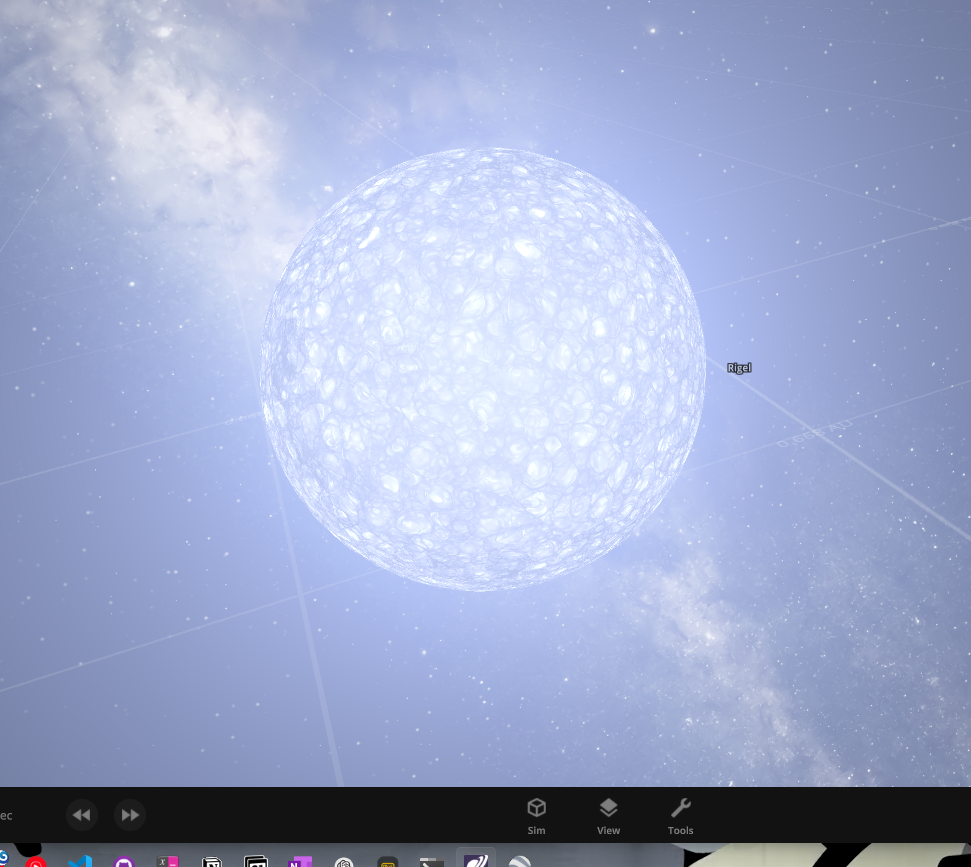
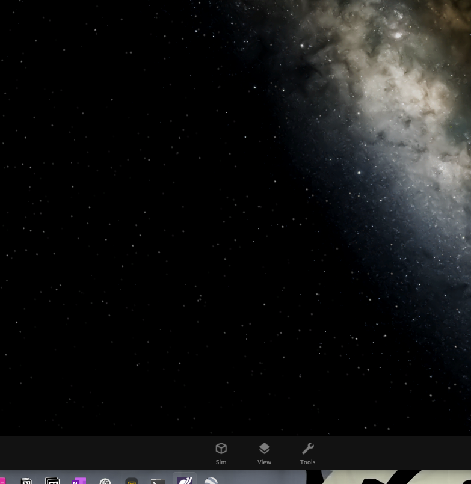

just some physics stuff :D

testing can be done in universe sandbox 2

schwarzschild radius: $R_{s}=\frac{2GM}{c^2}$

With $G$ being the gravitational constant (around $6.67\times10^{-11}$).

$M$ being the mass of the object.

$c$ being the speed of light / speed of causality (cause => effect).

$c$ can be $\approx 299'000'000\frac{m}{s}$. (https://en.wikipedia.org/wiki/Speed_of_light)

## Rigel's $R_s$

first, create a new sim, then load rigel into it:

next, run `run.sh`, and you'll soon see that the result for rigel is around the $\approx 53'000$ mark, so decrease it's radius to that.

wait.. where did it go?

now, it has become a black hole, and you cannot see it easily with the naked eye anymore. that's why even the best telescopes have a hard time detecting new black holes, due to **nothing** escaping it's event horizon.
